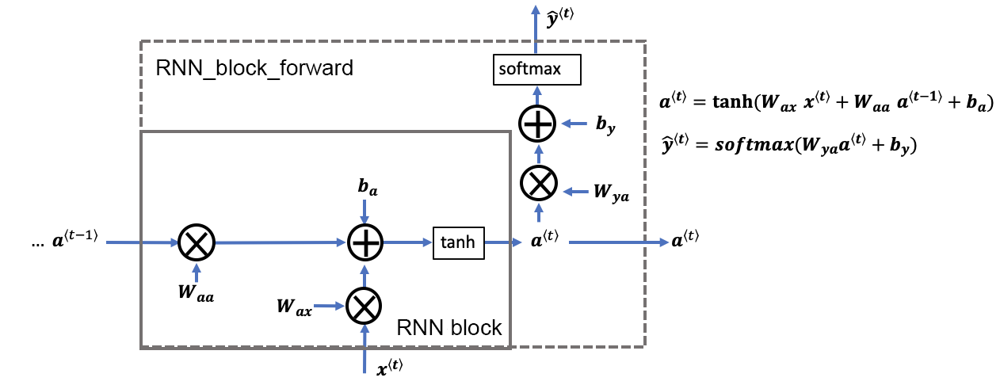
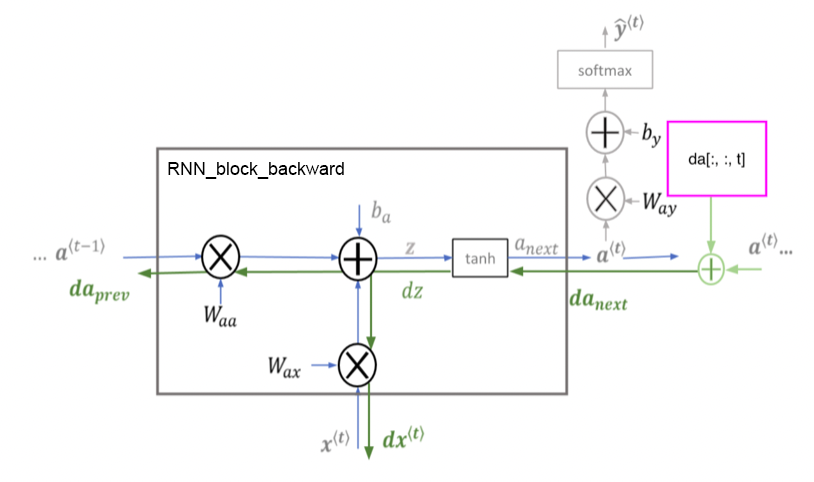
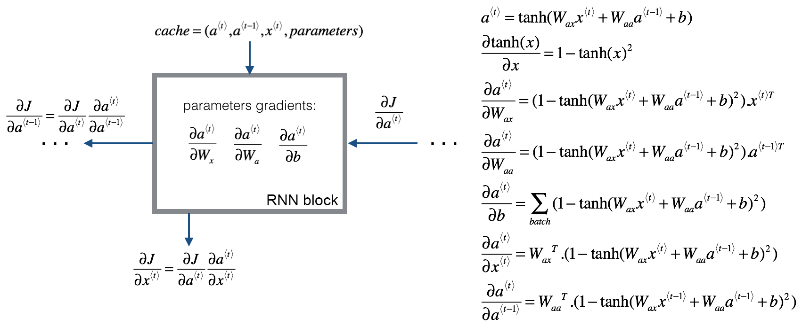
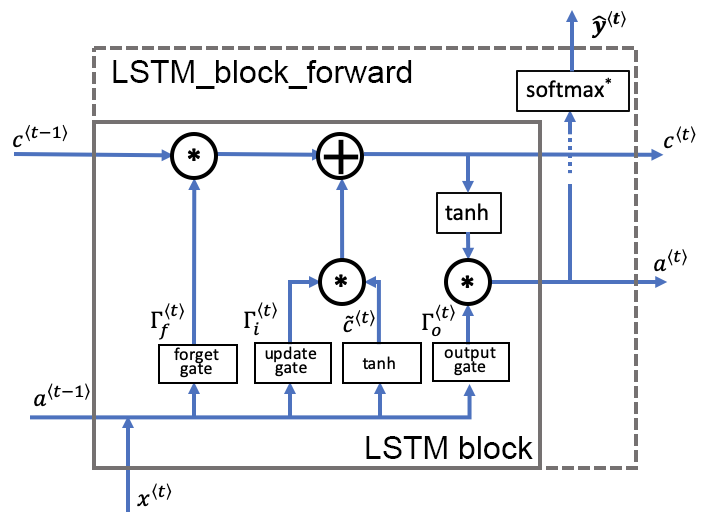
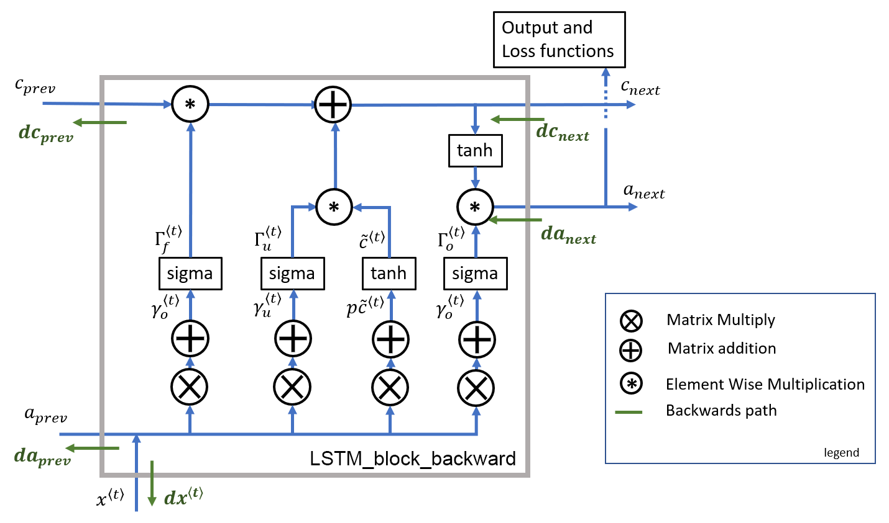

# Recurrent Neural Networks (RNN) and Long Short-term Memory (LSTM)

This project aims to explore the basics of Recurrent Neural Networks (RNN) and Long Short-term Memory (LSTM) models. The following block diagrams provide insights into the core functionality implementation of these models. This code is implemented using numpy only. 

## RNN

### RNN Block Architecture for Forward Pass

### RNN Block Backpropagation

## LSTM

### LSTM Block Architecture for Forward Pass

### LSTM Block Backpropagation

## Image Sources

1. RNN Block Diagram: [Source](./Block_diagrams/RNN.png)
2. RNN Forward Pass: [Source](./Block_diagrams/rnn_forward.png)
3. RNN Block Backward: [Source](./Block_diagrams/rnn_block_backward.png)
4. RNN Block Backpropagation: [Source](./Block_diagrams/rnn_block_backprop.png)
5. LSTM Block Diagram: [Source](./Block_diagrams/LSTM.png)
6. LSTM Forward Pass: [Source](./Block_diagrams/LSTM_forward.png)
7. LSTM Block Backward: [Source](./Block_diagrams/LSTM_block_backward.png)